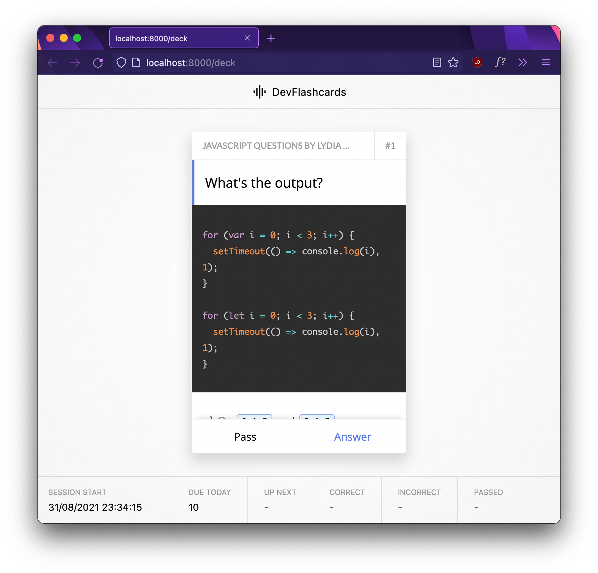

# DevFlashCards (WIP)

A flashcards app for developers!

Features a 155 cards deck with content from the awesome [Javascript Questions by Lydia Hallie.](https://github.com/lydiahallie/javascript-questions).
Uses [Supermemo](https://github.com/Maxvien/supermemo) as spaced repetition algo implementation.

---

### Stack

- Gatsby
- Emotion
